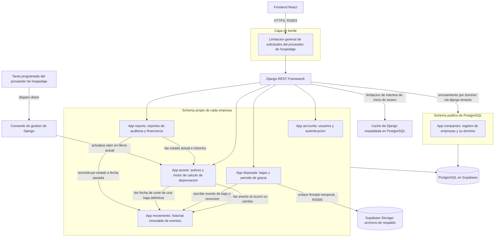

# Decisiones de Arquitectura del Backend

## Propósito de este documento

Este documento reúne, de forma numerada y trazable, las decisiones tomadas sobre la arquitectura del backend del Sistema de Gestión de Activos Fijos. Cada decisión (identificada como `DA` seguido de un número) indica el contexto que la motivó, la decisión tomada, su justificación, y la referencia directa a los documentos de reglas de negocio (`RN`) y requerimientos (`RF`, `RL`, `RS`, `RP`) que la originan, siguiendo el mismo esquema de trazabilidad que ya usa el proyecto.

## Diagrama general del backend

## DA01. Multitenencia mediante schema por empresa con django tenants

**Contexto.** RS002 exige que un usuario de una empresa nunca pueda ver ni modificar datos de otra empresa, bajo ninguna circunstancia, incluso ante errores de otras partes del sistema. RP003 exige que el rendimiento de una empresa cliente no se vea afectado por la cantidad de otras empresas que también usan el sistema.

**Decisión.** Cada empresa cliente cuenta con su propio schema dentro de una misma base de datos PostgreSQL, administrado mediante la librería `django tenants`. El enrutamiento hacia el schema correcto ocurre automáticamente según el dominio o identificador de la empresa asociado a cada solicitud.

**Justificación.** Una columna compartida de identificador de empresa depende enteramente de que cada consulta futura la filtre correctamente; un olvido en una sola consulta expondría datos contables de una empresa a otra. Separar por schema traslada esa garantía al motor de la base de datos en lugar de dejarla exclusivamente en manos de la disciplina del código, sin llegar al costo operativo de una base de datos completa por cliente.

**Alternativas descartadas.** Columna compartida de identificador de empresa sin refuerzo adicional (riesgo de fuga por error humano en una sola consulta). Base de datos separada por empresa (costo operativo desproporcionado para el volumen actual, contrario al principio de diseño número cuatro del proyecto).

**Trazabilidad.** RS002, RP003, principio de diseño número dos del proyecto.

## DA02. Registro de empresas en un schema público compartido

**Contexto.** El sistema necesita saber, antes de poder atender cualquier solicitud, a qué empresa pertenece y por lo tanto a qué schema debe dirigirse.

**Decisión.** Existe un schema público con una única app compartida entre todas las empresas, llamada `companies`, encargada de guardar el registro de empresas clientes y su dominio o identificador asociado.

**Justificación.** Este registro es, por definición, información que debe consultarse antes de determinar en qué schema de empresa se está operando, por lo que no puede vivir dentro de ningún schema de empresa individual.

**Trazabilidad.** RS002, requisito técnico de la librería `django tenants`.

## DA03. Usuarios dentro del schema de su propia empresa

**Contexto.** RF006 exige inicio de sesión, RS001 exige manejo seguro de contraseñas, y RS002 exige aislamiento total entre empresas.

**Decisión.** Los usuarios no se guardan en una tabla global compartida entre todas las empresas; cada empresa cuenta con su propia tabla de usuarios dentro de su schema.

**Justificación.** Mantener los usuarios dentro del schema de su empresa refuerza el aislamiento definido en DA01 en lugar de introducir una excepción a esa regla. Evita además que una fuga en la tabla de usuarios revele qué empresas usan el sistema, o que se intenten accesos cruzados entre empresas a nivel de autenticación.

**Trazabilidad.** RS001, RS002, RF006.

## DA04. Cálculo de depreciación en la capa de aplicación, reconstruible desde el historial

**Contexto.** RN001 define el método de línea recta con precisión de días. RF007.3 exige poder consultar el estado y la depreciación de un activo a cualquier fecha pasada, generado a partir del historial de movimientos y no de archivos guardados aparte.

**Decisión.** El valor en libros y la depreciación acumulada de un activo se calculan mediante una función pura en Python, a partir de los datos base del activo y de los eventos relevantes de su historial. No se usan columnas generadas ni funciones almacenadas en la base de datos para este cálculo.

**Justificación.** La fórmula de línea recta con precisión de días es aritmética simple sobre pocos valores; calcularla en la capa de aplicación evita depender de funciones propias del motor de base de datos, mantiene toda la lógica de negocio en un único lugar auditable, y satisface de forma directa el requisito de reconstrucción histórica de RF007.3, ya que el mismo cálculo sirve tanto para la fecha de hoy como para cualquier fecha pasada.

**Alternativas descartadas.** Columnas generadas o disparadores en la base de datos (acoplan la lógica de negocio al motor de base de datos, dificultan las pruebas unitarias y la trazabilidad hacia el código fuente).

**Trazabilidad.** RN001.1, RN001.2, RN001.3, RN001.6, RF002.1, RF007.3.

## DA05. Campo de valor actual como atajo de lectura, con el historial como única fuente de verdad

**Contexto.** Consultar el valor en libros de miles de activos en un listado (RF002.3, RP001) debe resolverse en menos de tres segundos. Recalcular el historial completo de cada activo en cada lectura de un listado sería innecesario cuando la mayoría de consultas piden simplemente el valor de hoy.

**Decisión.** El modelo `Activo` guarda un campo de valor en libros actual y depreciación acumulada actual, concebido únicamente como atajo de lectura rápida. Ese campo se actualiza de inmediato ante cualquier evento relevante del historial (cambio de costo, cambio de vida útil, baja definitiva) y, adicionalmente, mediante un proceso diario que lo avanza con el simple paso del tiempo. Cualquier consulta a una fecha pasada ignora este campo y recalcula desde el historial según DA04.

**Justificación.** El historial sigue siendo la única fuente de verdad, ya que este campo es enteramente derivable de él en cualquier momento; su único propósito es evitar recalcular en cada lectura algo que ya se conoce para la fecha de hoy.

**Trazabilidad.** RF002.3, RP001, RN001.3.

## DA06. Proceso diario mediante comando de Django y tarea programada externa, sin Celery

**Contexto.** El campo definido en DA05 necesita actualizarse una vez al día. RP002 pide explícitamente evitar procesamiento en segundo plano para la generación de reportes, y el principio de diseño número cuatro del proyecto pide evitar sobreingeniería hasta que el volumen real lo justifique.

**Decisión.** La actualización diaria se implementa como un comando de gestión de Django, disparado por una tarea programada externa provista por el proveedor de hospedaje o un servicio equivalente. No se introduce Celery ni un intermediario de mensajes como Redis para esta tarea.

**Justificación.** La tarea es simple, idempotente, y no requiere reintentos complejos ni monitoreo especializado. Introducir Celery añadiría una pieza de infraestructura nueva que operar y pagar desde el primer día, para un beneficio que hoy no existe.

**Alternativas descartadas.** Celery con Celery Beat, justificable únicamente si en el futuro aparecen tareas asíncronas más pesadas o que requieran reintentos automáticos.

**Trazabilidad.** RP002, principio de diseño número cuatro del proyecto.

## DA07. Sin caché dedicada para datos de negocio en el producto mínimo viable

**Contexto.** Se evaluó explícitamente si incluir una capa de caché dedicada, como Redis, desde el inicio del proyecto.

**Decisión.** No se introduce Redis ni ninguna caché dedicada para datos de negocio en esta etapa. Toda interacción con caché en el código se realiza exclusivamente a través del framework de caché de Django, respaldado por defecto en la base de datos.

**Justificación.** Dado el volumen actual de datos (miles de activos por empresa, no millones) y que el cálculo de depreciación ya evita el problema de rendimiento por diseño (DA04 y DA05), una caché dedicada no resuelve ningún cuello de botella real todavía. Usar la interfaz de caché de Django, en vez de acceder directamente a la base de datos, permite que el día que una funcionalidad nueva sí necesite una caché real, el cambio sea de configuración y no de código: basta con cambiar el motor declarado en el ajuste de caché de Django para que todo el código existente empiece a usar Redis automáticamente, sin modificar una sola línea de lógica de negocio.

**Trazabilidad.** RP001, principio de diseño número cuatro del proyecto.

## DA08. Control de acceso mediante limitación de intentos, combinando borde y aplicación

**Contexto.** RS001 exige manejo seguro de contraseñas. Un ataque de fuerza bruta contra el inicio de sesión es un riesgo de seguridad incluso cuando las contraseñas están bien protegidas.

**Decisión.** Se combinan dos capas, cada una responsable de un tipo distinto de protección. La primera es la limitación de solicitudes que ofrezca el proveedor de hospedaje o la capa de borde, si está disponible, como protección general frente a volúmenes anormales de tráfico. La segunda es la limitación nativa de Django REST Framework, respaldada por el framework de caché de Django descrito en DA07, aplicada específicamente al inicio de sesión, para bloquear por usuario o por origen tras cierta cantidad de intentos fallidos.

**Justificación.** La protección de borde detiene ataques masivos antes de que lleguen a la aplicación. La protección a nivel de aplicación entiende la lógica de negocio propia del inicio de sesión, algo que la capa de borde no puede distinguir por sí sola.

**Trazabilidad.** RS001.

## DA09. División del backend en apps de Django según responsabilidad única

**Contexto.** El sistema cubre registro de activos, cálculo de depreciación, historial de movimientos, bajas, y reportes, cada uno con reglas propias y razones de cambio distintas.

**Decisión.** El backend se organiza en una app compartida (`companies`) dentro del schema público, y en varias apps dentro del schema de cada empresa: `accounts`, `assets`, `movements`, `disposals` y `reports`.

**Justificación.** Cada app agrupa una sola responsabilidad y una sola razón para cambiar. Un cambio en la fórmula de depreciación queda contenido en `assets`. Un cambio en el proceso de baja queda contenido en `disposals`. Un cambio en el formato de un reporte queda contenido en `reports`, sin arriesgar al resto del sistema.

**Trazabilidad.** RF001, RF002, RF003, RF004, RF005, RF007.

## DA10. El historial de movimientos como fuente única compartida entre altas, cambios y bajas

**Contexto.** RF007.1 exige registrar todo evento que afecte el valor o la clasificación de un activo (alta, cambio de costo, cambio de vida útil, cambio de área o tipo, baja, reversión de baja). RS004 pide explícitamente evitar construir dos sistemas de historial separados.

**Decisión.** Existe una sola app, `movements`, con una tabla de solo escritura donde ningún registro se edita ni se borra una vez guardado. Tanto `assets` como `disposals` escriben en esta misma tabla cuando ocurre un evento relevante, en lugar de mantener cada una su propio historial paralelo.

**Justificación.** Cumple RS004 de forma directa y evita que dos historiales puedan desincronizarse entre sí, lo cual sería un riesgo grave en un sistema contable donde la trazabilidad es además un requisito legal.

**Trazabilidad.** RF007.1, RF007.2, RS004, RL001.

## DA11. El activo nunca se elimina ni cambia de tabla al darse de baja

**Contexto.** Se evaluó explícitamente si una baja debía eliminar el activo o trasladarlo a otra tabla.

**Decisión.** Dar de baja un activo nunca elimina su fila ni la traslada a una tabla distinta. El activo permanece de forma permanente en la misma tabla; una baja únicamente agrega información relacionada (el registro correspondiente en `disposals` y los eventos correspondientes en `movements`) y cambia su condición visible en listados y reportes.

**Justificación.** El activo debe seguir existiendo y ser consultable durante todo el plazo de retención legal (RL001), debe poder aparecer en el reporte de auditoría junto con su historial completo (RF004), y debe poder consultarse a cualquier fecha pasada incluyendo fechas anteriores a su baja (RF007.3). Trasladarlo a otra tabla obligaría a duplicar consultas y relaciones en todo reporte que necesite ver, en conjunto, activos vigentes y activos dados de baja.

**Trazabilidad.** RL001, RF004, RF007.3, RN002.6.

## DA12. La baja es una fila propia y mutable durante su periodo de gracia

**Contexto.** RN002.4 exige que una baja quede en estado pendiente durante dos días, con posibilidad de revertirse en ese plazo. RF007.2 exige, al mismo tiempo, que el historial de movimientos sea permanente e inalterable.

**Decisión.** La baja se modela como su propia fila en `disposals`, con un campo de estado (pendiente, revertida o definitiva) que sí puede cambiar mientras dure el periodo de gracia. La tabla `movements` únicamente registra, de forma inalterable, el hecho consumado de que una baja se creó y, si corresponde, de que se revirtió, sin reescribir jamás un registro ya guardado.

**Justificación.** Modelar la baja únicamente como un evento dentro de `movements` entraría en conflicto directo con la inalterabilidad exigida a esa tabla, ya que el periodo de gracia exige justamente lo contrario mientras está vigente. Separar ambas piezas permite que cada una cumpla su propia regla sin contradicción: `disposals` puede mutar dentro de un plazo acotado por la propia regla de negocio, `movements` nunca muta.

**Trazabilidad.** RN002.4, RN002.6, RF007.2.

## DA13. El motor de depreciación lee la fecha de corte desde el historial, nunca desde las bajas directamente

**Contexto.** RN002.3 exige que la depreciación deje de calcularse desde la fecha efectiva de una baja. El motor de depreciación vive en `assets`, y las bajas viven en `disposals`, que a su vez depende de `assets` para saber a qué activo pertenece cada baja.

**Decisión.** Cuando el motor de depreciación necesita saber si un activo tiene una baja definitiva y desde qué fecha, consulta el evento correspondiente en `movements`, nunca el modelo `Disposal` directamente.

**Justificación.** Si `assets` dependiera directamente de `disposals` para su propio cálculo, se formaría una dependencia circular entre ambas apps, dado que `disposals` ya depende de `assets` para referenciar al activo. Al pasar siempre por `movements`, que ambas apps ya alimentan, el grafo de dependencias entre apps queda en una sola dirección.

**Trazabilidad.** RN002.3.

## DA14. La depreciación se corta solo cuando la baja se vuelve definitiva

**Contexto.** RN002.3 no aclara si el corte de depreciación aplica desde que la baja queda pendiente o solo cuando se vuelve definitiva, y una baja pendiente todavía puede revertirse dentro de los dos días de gracia (RN002.4).

**Decisión.** Mientras una baja esté en periodo de gracia (estado pendiente), el activo continúa depreciándose con total normalidad, aunque se muestre como pendiente de baja en listados y reportes según RN002.5. El corte real de la depreciación ocurre únicamente cuando la baja pasa a estado definitiva, aplicado de forma retroactiva a la fecha efectiva indicada al registrar la baja.

**Justificación.** Evita tener que revertir un corte de depreciación que nunca debió aplicarse, en caso de que la baja termine siendo cancelada dentro del periodo de gracia, simplificando tanto el cálculo como las pruebas asociadas.

**Trazabilidad.** RN002.3, RN002.4.

## DA15. Separación entre el estado de depreciación y la condición de baja pendiente

**Contexto.** RN001.7 exige que el activo refleje en todo momento exactamente uno de dos estados de depreciación (depreciando, totalmente depreciado). RN002.5 exige, además, que el activo se muestre como pendiente de baja durante el periodo de gracia.

**Decisión.** El campo de estado de depreciación en el modelo `Activo` conserva exactamente los dos valores exigidos por RN001.7 y nunca se combina con la condición de baja. La condición de pendiente de baja no se guarda como campo en `Activo`; se deriva, al momento de leer un listado o un reporte, de la existencia de una fila relacionada en `disposals` con estado pendiente.

**Justificación.** Combinar ambas condiciones en un solo campo introduciría un tercer valor no contemplado por RN001.7, y obligaría a mantener sincronizados dos conceptos independientes desde dos apps distintas. Mantenerlos separados elimina esa fuente de inconsistencia.

**Trazabilidad.** RN001.7, RN002.5.

## DA16. Enrutamiento del navegador al schema de su empresa mediante subdominio propio

**Contexto.** DA01 define que el enrutamiento hacia el schema correcto ocurre "según el dominio... asociado a cada solicitud", pero no especifica cómo el navegador del usuario llega a ese dominio antes de ver la pantalla de inicio de sesión, dado que RF-006 no contempla ningún paso de selección de empresa previo al usuario/contraseña.

**Decisión.** Cada empresa cliente recibe un subdominio propio bajo un único dominio de marca (ej. `acme.sistema.com`, `beta.sistema.com`), resuelto mediante un registro DNS wildcard (`*.sistema.com`) y un certificado TLS wildcard. El campo `domain` de la tabla `domain` (`db/schema.sql`), asociada a `empresa` por `tenant_id`, guarda ese subdominio completo. El usuario navega directamente a la URL de su empresa; no existe pantalla de selección de empresa antes del formulario de usuario/contraseña.

**Justificación.** El middleware de `django-tenants` resuelve el schema a partir del header `Host` de la petición, antes de que esta llegue a cualquier vista — incluida la de login. Con un subdominio por empresa, esa resolución ocurre de forma automática y nativa a la librería, sin necesitar un endpoint público adicional que traduzca un código de empresa a un dominio (superficie de ataque que sí requeriría el patrón alternativo de dominio único con selector). Tampoco requiere comprar un dominio por empresa: los subdominios se generan bajo el dominio de marca ya existente, sin costo ni gestión de DNS adicional en cada alta de cliente.

**Consecuencia de seguridad relevante.** La sesión ya no se guarda en `localStorage`: el JWT vive en cookies `httpOnly` (inaccesibles a JS), que el navegador aísla por origen — una cookie fijada en `acme.sistema.com` no es legible ni enviada por código ejecutándose en `beta.sistema.com`. Esto refuerza RS-002 igual o mejor que `localStorage` (que también aísla por origen pero sí es legible por JS, y por tanto vulnerable a robo por XSS), sin exponer el token a JavaScript ni necesitar lógica extra en la aplicación.

**Consecuencia operativa.** Si un usuario intenta iniciar sesión en el subdominio de una empresa distinta a la suya, la consulta de `usuario` corre exclusivamente contra el schema ya fijado por el middleware antes del login; el sistema nunca busca el usuario en otro schema. El mensaje de error debe ser genérico e idéntico tanto si el usuario no existe en ese schema como si la contraseña es incorrecta, para no filtrar en qué empresa existe una cuenta (RS-002). El frontend puede mostrar el subdominio actual en la pantalla de login como ayuda de autoverificación, ya que ese dato no revela nada que la URL visible en el navegador no revele ya.

**Alternativas descartadas.** Dominio único con un selector de empresa previo al login: evita el DNS wildcard, pero introduce un endpoint público nuevo (resolución de empresa) que hay que proteger contra enumeración de clientes, y no es el patrón de uso por defecto de `django-tenants`.

**Trazabilidad.** DA01, DA02, DA03, RS-002, RF-006.1.
